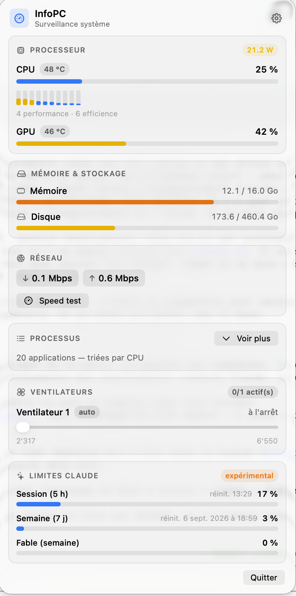

# InfoPC

**Moniteur système et contrôle des ventilateurs dans la barre de menus, pour Mac Apple Silicon.**

macOS 13+ · Apple Silicon · ~340 Ko · sans dépendance

<p align="center">
  
</p>

InfoPC affiche l'usage et la température du CPU et du GPU directement dans la barre
de menus, et ouvre un panneau détaillé au clic : cœurs P/E un par un, mémoire,
disque, réseau, processus les plus gourmands — et surtout **le régime réel des
ventilateurs, avec un curseur pour le forcer**, ce que macOS n'expose nulle part.

<p align="center">
  
</p>

## Ce que ça fait

| | |
|---|---|
| **CPU** | usage global et **par cœur logique** (P et E distingués), température (capteur le plus chaud), puissance système |
| **GPU** | usage et température |
| **Mémoire** | utilisée / totale |
| **Disque / réseau** | espace libre, débits montant et descendant en direct |
| **Ventilateurs** | nombre, régime en tr/min, bornes min/max, **curseur de contrôle** et retour au mode Auto |
| **Processus** | top consommateurs regroupés par application, avec bouton KILL |
| **Limites Claude** | usage du compte Claude Code — *fonction expérimentale, voir plus bas* |

La barre de menus est personnalisable : cochez ce que vous voulez y voir
(CPU, GPU, RAM, réseau, température) dans le menu engrenage du panneau.

**Français ou anglais**, au choix dans ce même menu engrenage. Au premier
lancement, l'app suit la langue du système.

## Installation

### Homebrew (recommandé)

```bash
brew install --cask kfcdorian/tap/infopc
```

### Téléchargement direct

Récupérez `InfoPC-x.y.z.zip` dans les [releases](https://github.com/KFCDorian/InfoPC/releases),
décompressez, glissez `InfoPC.app` dans `/Applications`.

L'app est signée en **ad-hoc** (pas de certificat Apple Developer à 99 $/an), donc
au premier lancement macOS affiche « InfoPC ne peut pas être ouvert ». Deux façons
de passer outre :

- **clic droit sur l'app → Ouvrir**, puis confirmez ; ou
- `xattr -dr com.apple.quarantine /Applications/InfoPC.app`

C'est le prix d'une app gratuite non notarisée — vous pouvez lire tout le code de
ce dépôt avant de lui faire confiance. Pour vérifier que vous avez bien le
fichier publié :

```bash
shasum -a 256 InfoPC-1.2.1.zip   # doit correspondre au SHA-256 des notes de release
```

Ce que l'app obtient sur votre machine, ce que fait le helper privilégié et
comment signaler une faille : [SECURITY.md](SECURITY.md).

### Depuis les sources

```bash
git clone https://github.com/KFCDorian/InfoPC.git
cd InfoPC
./scripts/install.sh          # compile, installe dans ~/Applications, démarrage auto
./scripts/install.sh --app    # idem, mais sans le helper ventilateurs (aucun sudo)
```

## Le contrôle des ventilateurs et le mot de passe

Écrire dans le SMC — la puce qui pilote les ventilateurs — **exige les droits
root**. Aucune app ne peut y couper. InfoPC ne tourne pas en root pour autant :
elle installe un petit binaire séparé, `infopc-fanctl`, qui est le seul à avoir
ce droit.

Au premier clic sur **« Activer le contrôle des ventilateurs »** dans le panneau,
macOS demande votre mot de passe une fois, puis :

- le binaire est installé dans `/Library/PrivilegedHelperTools/com.kfcdorian.infopc.fanctl`,
  répertoire que macOS garde à `root:wheel` — un programme tournant sous votre
  compte ne peut donc pas le remplacer ;
- `/etc/sudoers.d/infopc` reçoit une règle **limitée à ce seul binaire et à votre
  compte** : `<vous> ALL=(root) NOPASSWD: /Library/PrivilegedHelperTools/com.kfcdorian.infopc.fanctl`.

L'app ne gagne aucun autre pouvoir. La règle est validée par `visudo` avant
d'être posée, et l'installation refuse de continuer si un répertoire du chemin
n'appartient pas à root. Pour tout retirer sans désinstaller l'app :

```bash
sudo rm -f /Library/PrivilegedHelperTools/com.kfcdorian.infopc.fanctl /etc/sudoers.d/infopc
```

Sans ce helper, InfoPC fonctionne en lecture seule : vous voyez les tr/min, vous
ne pouvez pas les changer.

> **Sur Apple Silicon, un ventilateur à 0 tr/min est normal.** Sous ~45 °C le SMC
> l'arrête complètement. Ce n'est pas une panne, et le mode **Auto** reste le bon
> choix par défaut : macOS gère très bien son refroidissement.

## Limites Claude — expérimental

Si vous utilisez Claude Code, le panneau affiche votre consommation réelle
(session de 5 h, semaine, et modèle en cours) en lisant votre jeton OAuth dans le
Trousseau et en interrogeant l'endpoint qui alimente la commande `/usage`.

**Cette fonction n'est garantie par rien.** L'endpoint n'est pas documenté :
Anthropic peut le changer du jour au lendemain et l'affichage cessera de
fonctionner. Elle est étiquetée « expérimental » dans l'app pour cette raison, et
le reste d'InfoPC n'en dépend pas. Si le jeton est absent, l'app retombe sur une
estimation locale calculée depuis `~/.claude/projects`.

Le jeton ne quitte jamais votre machine, sauf vers `api.anthropic.com`. Si vous
lancez Claude Code depuis l'app Claude pour macOS, aucun jeton lisible n'est
déposé dans le Trousseau : connectez-vous une fois avec le CLI `claude`.

## Vie privée

Aucune télémétrie, aucun compte, aucune analyse d'usage. InfoPC ne contacte le
réseau que dans deux cas, tous deux visibles :

- **`api.anthropic.com`**, pour les limites Claude, uniquement si un jeton Claude
  Code est présent sur la machine. Le jeton est lu dans le Trousseau à chaque
  appel, jamais écrit sur disque ni journalisé.
- **`speed.cloudflare.com`**, seulement quand vous cliquez sur **Speed test** :
  la mesure télécharge puis téléverse quelques mégaoctets, et votre adresse IP
  est donc vue par Cloudflare, comme pour n'importe quel test de débit.

Tout le reste — capteurs, ventilateurs, processus, lecture de `~/.claude/projects`
pour l'estimation locale — ne quitte jamais votre machine.

## Désinstallation

```bash
./scripts/uninstall.sh              # depuis les sources
brew uninstall --cask infopc        # depuis Homebrew
```

## Limites connues

- **Apple Silicon uniquement.** Les clés SMC des Mac Intel diffèrent (`F0Md` au
  lieu de `F0md`, capteurs de température différents).
- **Pas d'usage GPU par processus** : macOS ne l'expose à aucune app, la colonne
  affiche « — ».
- Développé et testé sur MacBook Pro **M5** (macOS 26). Les retours sur d'autres
  puces sont les bienvenus dans les [issues](https://github.com/KFCDorian/InfoPC/issues).

## Développement

Swift Package pur, sans Xcode.

```bash
swift build -c release
./scripts/package.sh              # fabrique dist/InfoPC-<version>.zip + son SHA-256
./.build/release/fanctl status    # état des ventilateurs
./.build/release/InfoPC --claude-debug
```

`Sources/SMCCore` (accès AppleSMC), `Sources/InfoPC` (l'app), `Sources/fanctl`
(le helper privilégié). Détails d'architecture dans [CLAUDE.md](CLAUDE.md).

## Licence

Pas de licence open source : le code est public pour que vous puissiez
l'inspecter avant d'installer, tous droits réservés pour l'instant.
